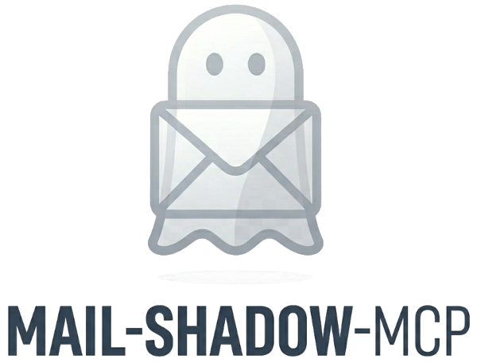

<div align="center">
  
</div>

# mail-shadow-mcp

> Structured, read-only email access for AI agents.

[](https://github.com/dryas/mail-shadow-mcp/actions/workflows/release.yml)
[](https://github.com/dryas/mail-shadow-mcp/releases/latest)
[](https://go.dev/)
[](https://goreportcard.com/report/github.com/dryas/mail-shadow-mcp)
[](LICENSE)

**mail-shadow-mcp** is a [Model Context Protocol (MCP)](https://modelcontextprotocol.io) server that creates a local shadow copy of your IMAP mailboxes in a SQLite database. AI agents query the local database through five well-defined MCP tools instead of connecting directly to your IMAP server.

```
[Remote IMAP Server] ──IMAP──▶ [Sync Engine] ──▶ [SQLite FTS5] ◀──▶ [MCP Server] ◀──▶ [AI Agent]
```

---

## Features

- **Local shadow database** — emails are synced into a local SQLite database; the AI agent never connects to your IMAP server directly
- **Read-only** — no `STORE`, `APPEND`, or `EXPUNGE` commands; your mailbox is never modified
- **Incremental sync** — only fetches messages newer than the last known UID
- **Full-text search** — SQLite FTS5 index for fast body-text queries
- **Multi-account** — sync any number of IMAP accounts simultaneously
- **On-demand attachments** — attachment files are fetched from IMAP only when explicitly requested

---

## MCP Tools

| Tool | Description |
|---|---|
| `list_accounts_and_folders` | List all synced accounts and their folders |
| `get_recent_activity` | N most recent emails with optional metadata filters |
| `get_email_content` | Full body text and attachment list for a single email |
| `search_emails` | FTS5 full-text search with subject/sender/date filters |
| `download_attachments` | Fetch attachment files from IMAP and save them to disk |

---

## Quick Start

### 1. Build

```bash
make build          # current platform
make release        # cross-compile for all platforms into dist/
```

Requires Go 1.25+.

### 2. Configure

Copy the example config and fill in your IMAP credentials:

```bash
cp config.example.yaml config.yaml
```

```yaml
sync_interval_min: 15

database:
  path: "data/mail.db"

attachment_dir: "data/attachments"

accounts:
  - id: "work@example.com"
    host: "imap.example.com"
    port: 993
    username: "work@example.com"
    password: "$WORK_IMAP_PASS"   # or plain text
    folders: ["INBOX", "Archive"] # omit to sync all folders
```

Credentials can be stored as plain text or as `$ENV_VAR` references that are resolved at runtime.

### 3. Run

```bash
# Start the MCP server (syncs on startup, then every sync_interval_min minutes)
./mail-shadow-mcp serve

# One-shot sync without starting the server
./mail-shadow-mcp sync

# Query from the command line (output is JSON)
./mail-shadow-mcp query --subject "invoice" --body "Q1"

# Download attachments for a specific email
./mail-shadow-mcp attachments --id "work@example.com:INBOX:42"
```

---

## Integrating with an AI Agent

Configure your MCP client to launch the server via stdio. 

Example for Claude Desktop (`claude_desktop_config.json`):

```json
{
  "mcpServers": {
    "mail_shadow": {
      "command": "/path/to/mail-shadow-mcp",
      "args": ["serve", "--config", "/path/to/config.yaml"]
    }
  }
}
```

Example for Hermes Agent (`config.yaml`):

```yaml
mcp_servers:
  mail_shadow:
    command: "/path/to/mail-shadow-mcp"
    args: ["serve", "--config", "/path/to/config.yaml"]
```

Example for OpenClaw (`~/.openclaw/openclaw.json`):

```json
{
  "mcpServers": {
    "mail_shadow": {
      "command": "/path/to/mail-shadow-mcp",
      "args": ["serve", "--config", "/path/to/config.yaml"],
      "transport": "stdio"
    }
  }
}
```

---

## TLS Modes

| `tls_mode` | Port | Description |
|---|---|---|
| `tls` | 993 | Implicit TLS (default) |
| `starttls` | 143 | STARTTLS upgrade |
| `none` | 143 | No encryption — localhost/testing only |

Set `tls_skip_verify: true` to accept self-signed certificates.

---

## License

Apache 2.0 — see [LICENSE](LICENSE) for details.  
Copyright (c) 2026 Benjamin Kaiser.
