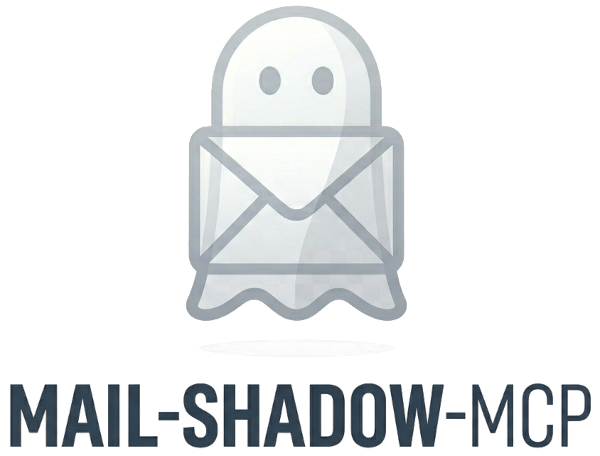

<div align="center">
  
</div>

[](https://github.com/dryas/mail-shadow-mcp/actions/workflows/release.yml)
[](https://github.com/dryas/mail-shadow-mcp/releases/latest)
[](https://go.dev/)
[](https://goreportcard.com/report/github.com/dryas/mail-shadow-mcp)
[](LICENSE)

### **Your AI Agent's Private, Secure, and Intelligent Inbox**

**Stop giving your AI direct access to your email. Give it a safe, lightning-fast and feature rich "shadow" copy instead.**

---

## What can you do with mail-shadow-mcp?

Imagine having a personal assistant who has read all your emails, knows exactly what's important, and can answer your questions in seconds — without ever risking your actual mailbox through a misbehaving or hallucinating AI.

With `mail-shadow-mcp`, you can ask your AI (like OpenClaw, Hermes Agent, Claude, Cursor or any other custom agent):

- *"Did I receive any invoices from Amazon in the last 3 days?"*
- *"Summarize the last email thread from my boss about the project status."*
- *"Please summarize all unread emails in my 'Project' folder."*
- *"Check if there are any flight confirmation emails in my inbox for next week."*
- *"Find all emails from 'newsletter@example.com' that have attachments."*
- *"Is there anything in my inbox that looks like spam or junk?"*

---

## Why does this exist?

Most AI agents require direct access to your email (IMAP) to "see" your messages. This is risky — because once an agent has live IMAP credentials, it has the same permissions as you: it can read, move, delete, or even send emails. A single hallucination, a misunderstood instruction, or a bug could lead to an AI accidentally deleting your entire inbox, sending a reply you never intended, or exposing your credentials to a third party.

**`mail-shadow-mcp` solves this by creating a "Safe Zone":**

1. **The Shadow Copy:** Instead of connecting to your real email server, we create a local, high-speed "shadow" database (SQLite) of your emails. This also unlocks capabilities that raw IMAP simply cannot offer: instant full-text search across all folders and accounts at once, complex filtering by read/replied status, attachments, date ranges, and sender — all without any round-trips to your mail server. And it works just as well with multiple mailboxes simultaneously — just add more accounts to the config.
2. **Total Privacy:** Your AI agent *only* ever talks to this local database. Your IMAP credentials are used exclusively by the sync engine — they are never exposed through any MCP tool call or returned to the agent in any response.
3. **The "Safety Net" (Soft-Delete):** Even if you ask the AI to "delete" an email, it doesn't actually delete it. It simply moves it to a "Trash" folder you've designated. If something goes wrong, you can always review the folder, restore individual emails, or permanently delete them yourself — you remain in total control.

```
[Remote IMAP Server] ──IMAP──▶ [Sync Engine] ──▶ [SQLite FTS5] ◀──▶ [MCP Server] ◀──▶ [AI Agent]
```

---

## Getting Started

The recommended way to run mail-shadow-mcp is via **Docker**. Running it in a container keeps the sync engine, credentials, and database fully isolated from your AI agent, which connects over HTTP. The agent never has access to the host filesystem or your IMAP password — only to the MCP API.

If you prefer to run it locally without Docker, you can download a pre-compiled binary from the [Releases page](https://github.com/dryas/mail-shadow-mcp/releases) and use `stdio` transport instead. However, this means the agent process and mail-shadow-mcp share the same user context, which reduces the isolation benefits described above.

### Step 1 — Start the container to generate the example config

Create local directories for config and data, then do a first run to generate the example config:

```bash
mkdir -p ./config ./data

docker run --rm \
  -v ./config:/config \
  -v ./data:/data \
  ghcr.io/dryas/mail-shadow-mcp:latest
```

The container will detect that no `config.yaml` exists, copy an annotated example config into `./config/`, print a message, and exit.

### Step 2 — Edit the config file

Open `./config/config.yaml` (or wherever your `/config` volume is mounted) and fill in your IMAP details:

```yaml
sync_interval_min: 15

database:
  path: "/data/mail.db"

attachment_dir: "/data/attachments"

transport: http
http_addr: ":8080"
http_bearer_token: "your-secret-token"   # generate one: openssl rand -hex 32

accounts:
  - id: "work@example.com"
    host: "imap.example.com"
    port: 993
    username: "work@example.com"
    password: "$WORK_IMAP_PASS"          # resolved from environment variable at startup
    tls_mode: tls                        # tls (default) | starttls | none
    tls_skip_verify: false               # set true for self-signed certificates
    folders: ["INBOX", "Archive"]        # omit to sync all folders
    idle_folders: ["INBOX"]              # optional: instant new-mail push via IMAP IDLE
    trash_folder: "llm_delete"           # target folder for soft-deletes via delete_mail
```

**Passwords as environment variables:** Instead of writing your IMAP password directly into the config file, use a `$VARIABLE_NAME` placeholder — mail-shadow-mcp will resolve it from the container's environment at startup. In the example above, `password: "$WORK_IMAP_PASS"` means the container reads the value from the `WORK_IMAP_PASS` environment variable, which you pass via `-e WORK_IMAP_PASS=your_password_here` when starting it (see Step 1 or 3). This way no plaintext password ends up in the config file.

**`folders`:** The list of IMAP folders to sync. If omitted, all folders are synced. Restricting to the folders you actually care about (e.g. `["INBOX", "Archive"]`) keeps the database smaller and initial sync faster.

**`idle_folders`:** Optional list of folders for which mail-shadow-mcp opens a persistent IMAP IDLE connection. When the mail server pushes an "EXISTS" notification, a sync is triggered immediately instead of waiting for the next poll interval so you will get informed about new mails in seconds. Keep this list short — each entry holds one open IMAP connection for the lifetime of the container. Best practice is to only add `"INBOX"` here, or leave it out entirely and rely on regular polling.

**`trash_folder`:** The IMAP folder that mail-shadow-mcp moves emails to when the AI agent calls the `delete_mail` tool. The folder must already exist on your mail server. If this is not set, `delete_mail` will return an error and do nothing — a safe default. Emails in the trash folder are automatically excluded from all MCP query results (search, recent activity, threads), so the agent can never see them again — regardless of whether the folder is included in the sync configuration. Note: if you ever change `trash_folder` to a different folder name, the old trash folder will no longer be excluded and its contents will become visible to the agent again on the next sync. Make sure to manually empty the old folder before switching.

**`http_bearer_token`:** A secret token that protects the MCP HTTP endpoint. Every request from the AI agent must include it as `Authorization: Bearer <token>`. Without this, anyone who can reach the port can talk to your MCP server — so always set this when running with `http` transport. Generate a secure random token with:

```bash
# Linux / macOS / WSL
openssl rand -hex 32
```

```powershell
# Windows PowerShell
[System.Convert]::ToBase64String((1..32 | ForEach-Object { [byte](Get-Random -Max 256) }))
```

Copy the output into the config and pass the same value to your AI agent (see Step 4).

### Step 3 — Start the container

```bash
docker run -d \
  --name mail-shadow-mcp \
  --restart unless-stopped \
  -v ./config:/config:ro \
  -v ./data:/data \
  -e WORK_IMAP_PASS=your_password_here \
  -p 8080:8080 \
  ghcr.io/dryas/mail-shadow-mcp:latest
```

The MCP server is now reachable at `http://localhost:8080/mcp`.

Pre-built multi-architecture images (`linux/amd64`, `linux/arm64`) are published to the GitHub Container Registry on every release:

```bash
docker pull ghcr.io/dryas/mail-shadow-mcp:latest
```

### Step 4 — Connect your AI agent

Since we're running with Docker, the MCP server is reachable via HTTP — and that works with Claude Desktop too, not just remote agents. Add the following to your agent's config:

**Claude Desktop** (`claude_desktop_config.json`):

```json
{
  "mcpServers": {
    "mail_shadow": {
      "url": "http://localhost:8080/mcp",
      "headers": {
        "Authorization": "Bearer your-secret-token"
      }
    }
  }
}
```

Replace `localhost` with your server's IP or hostname if mail-shadow-mcp runs on a different machine.

**Hermes Agent** (`config.yaml`):

```yaml
  mail-shadow:
    url: http://localhost:8080/mcp
    headers:
      Authorization: Bearer your-secret-token
```

**OpenClaw** (`~/.openclaw/openclaw.json`):

```json
{
  "mcp": {
    "servers": {
      "mail_shadow": {
        "url": "http://localhost:8080/mcp",
        "transport": "streamable-http",
        "headers": {
          "Authorization": "Bearer your-secret-token"
        }
      }
    }
  }
}
```

**Alternative: local stdio (pre-compiled binary, no Docker)**

If you chose to run the binary directly instead of Docker, use the `command` form:

```json
{
  "mcpServers": {
    "mail_shadow": {
      "command": "/path/to/mail-shadow-mcp",
      "args": ["serve", "--config", "/path/to/config.yaml"]
    }
  }
}
```

That's it — your AI can now search and read your emails safely.

---

## Safety: Nothing Is Ever Really Deleted

mail-shadow-mcp gives AI agents a `delete_mail` tool, but this tool **never issues a destructive IMAP command**. Here is exactly what happens when an agent calls it:

1. The MCP server looks up the email in the local database.
2. It opens a short-lived IMAP connection and executes **IMAP MOVE** — moving the message to the `trash_folder` you specify in `config.yaml` (e.g. `"llm_delete"`).
3. The local database entry is removed, and the trash folder is permanently excluded from all MCP query results — the agent can never see the moved email again, regardless of whether the folder is synced.
4. The email remains **intact on the IMAP server**, safely tucked away in the trash folder. You can inspect, restore, or permanently delete it yourself at any time.

The AI agent has no direct IMAP access. It cannot expunge messages, empty folders, or issue any write command other than this controlled move. If `trash_folder` is not configured for an account, `delete_mail` returns an error and does nothing.

---

## Technical Deep Dive

### MCP Tools

| Tool | Description |
|---|---|
| `list_accounts_and_folders` | List all synced accounts and their folders |
| `get_recent_activity` | N most recent emails with optional filters (`is_read`, `has_attachments`, pagination) |
| `get_email_content` | Full body text, read/replied status, and attachment list for a single email |
| `search_emails` | FTS5 full-text search with subject/sender/date/folder/`is_read`/`sent_by` filters |
| `get_thread` | All emails in the same thread as a given email, sorted by date ascending |
| `download_attachments` | Fetch attachment files from IMAP and save them to disk |
| `get_download_link` | Generate a temporary HTTP download URL for attachments (optional fallback) |
| `delete_mail` | Soft-delete an email by moving it to a configured trash folder (IMAP MOVE, no permanent deletion) |

### Feature Overview

- **Local shadow database** — emails are synced into a local SQLite database; the AI agent never connects to your IMAP server directly
- **Read-only sync** — the sync engine only issues read commands (`SELECT`, `UID FETCH`); no `STORE`, `APPEND`, or `EXPUNGE` is ever sent to your mail server
- **Incremental sync** — only fetches messages newer than the last known UID
- **Full-text search** — SQLite FTS5 index for fast body-text queries
- **Multi-account** — sync any number of IMAP accounts simultaneously
- **IMAP IDLE** — optional real-time push notifications; new mail detected within seconds instead of waiting for the next poll interval
- **Read/replied status** — `is_read` and `is_replied` flags synced from IMAP and exposed as filters
- **Thread view** — `get_thread` walks full email conversations via `Message-ID` / `In-Reply-To` headers
- **Paginated results** — all list tools return `total_count` so agents can page through large result sets
- **On-demand attachments** — attachment files are fetched from IMAP only when explicitly requested
- **Flexible transport** — `stdio` for local tools (Claude Desktop), `http` (StreamableHTTP) or `sse` for remote and Docker deployments
- **Docker-ready** — official multi-arch image (`linux/amd64`, `linux/arm64`) published to `ghcr.io` on every release

### Full Configuration Reference

```yaml
sync_interval_min: 15

database:
  path: "data/mail.db"      # path to the local SQLite shadow database

attachment_dir: "data/attachments"  # base directory for downloaded attachments

# Optional: log file and level. Omit log_file to write to stderr (default).
# log_file: "logs/mail-shadow-mcp.log"  # append mode; directory is created automatically
# log_level: info                        # debug | info (default) | warn | error
# log_format: text                       # text (default) | json

# MCP transport mode.
# stdio (default) — stdin/stdout, used by Claude Desktop and most local tools.
# http            — StreamableHTTP, recommended for Docker and remote deployments.
# sse             — legacy SSE transport (prefer http unless your client requires SSE).
# transport: stdio
# http_addr: ":8080"                      # bind address for http/sse (default: :8080)
# http_base_url: "http://localhost:8080"  # sse only: externally reachable base URL
# http_bearer_token: ""                  # recommended: set a secret token to protect the HTTP endpoint
                                         # generate one with: openssl rand -hex 32

# Optional: lightweight HTTP server for temporary attachment download links.
# fileserver_port: 8787               # TCP port to listen on (disabled if omitted)
# fileserver_ttl_min: 15              # minutes before a link expires (default: 15)
# fileserver_host: "localhost"        # hostname/IP shown in generated URLs

accounts:
  - id: "work@example.com"
    host: "imap.example.com"
    port: 993
    username: "work@example.com"
    password: "$WORK_IMAP_PASS"     # or plain text; prefix with $ to read from env var
    tls_mode: tls                   # tls (default, implicit TLS, port 993)
                                    # starttls (STARTTLS upgrade, port 143)
                                    # none (no encryption — localhost/testing only)
    tls_skip_verify: false          # set true for self-signed certificates
    folders: ["INBOX", "Archive"]   # optional: omit to sync all folders
    # idle_folders: ["INBOX"]       # optional: folders watched via IMAP IDLE for instant new-mail notification
    # trash_folder: "llm_delete"    # optional: target folder for delete_mail (soft-delete via IMAP MOVE)
```

### Docker Compose

```yaml
services:
  mail-shadow-mcp:
    image: ghcr.io/dryas/mail-shadow-mcp:latest
    restart: unless-stopped
    ports:
      - "8080:8080"
    volumes:
      - ./config/config.yaml:/config/config.yaml:ro   # your config — mount read-only
      - ./data:/data                                  # persistent DB + attachments
    environment:
      - WORK_IMAP_PASS=your_password_here             # referenced as $WORK_IMAP_PASS in config
```

> **Passwords as environment variables:** In `config.yaml` you can reference passwords as `$ENV_VAR` — the server resolves them at startup. Pass them via `environment:` in docker-compose or via `-e` with `docker run`. This way no plaintext password ends up in the config file.

### TLS Modes

| `tls_mode` | Port | Description |
|---|---|---|
| `tls` | 993 | Implicit TLS (default) |
| `starttls` | 143 | STARTTLS upgrade |
| `none` | 143 | No encryption — localhost/testing only |

Set `tls_skip_verify: true` to accept self-signed certificates.

### Authentication (Bearer Token)

When using `http` or `sse` transport, **always set `http_bearer_token`** — otherwise the MCP endpoint is reachable by anyone who can access the port.

Generate a cryptographically secure token:

```bash
# Linux / macOS / WSL
openssl rand -hex 32

# PowerShell
[System.Convert]::ToBase64String((1..32 | ForEach-Object { [byte](Get-Random -Max 256) }))
```

### IMAP IDLE (Real-time Push)

By default, mail-shadow-mcp polls for new messages every `sync_interval_min` minutes. For folders where you want near-instant notifications, enable IMAP IDLE:

```yaml
accounts:
  - id: "work@example.com"
    # ...
    idle_folders: ["INBOX"]   # IDLE runs on top of regular polling
```

- One dedicated IMAP connection is opened per entry in `idle_folders`
- When the server sends an `EXISTS` notification, a sync is triggered immediately
- Regular polling continues unchanged for all other folders
- Falls back to polling automatically if the server does not support IDLE
- Exponential backoff (30 s → 5 min) on persistent connection errors

### Attachment Download Server

The optional built-in HTTP server lets the AI agent generate temporary, single-use download links for attachment files — useful as a fallback when the agent cannot transfer files through its normal channels.

Enable it in `config.yaml`:

```yaml
fileserver_port: 8787        # TCP port to listen on
fileserver_ttl_min: 15       # minutes before a link expires (default: 15)
fileserver_host: "localhost" # hostname/IP shown in generated URLs
```

### Building from Source

```bash
make build          # current platform
make release        # cross-compile for all platforms into dist/
```

Requires Go 1.25+.

### CLI Commands

Beyond running as an MCP server, `mail-shadow-mcp` exposes a few CLI commands that are useful for manual operations, scripting, or debugging — without needing an AI agent at all.

**Trigger a one-shot sync** (fetches new emails into the local database and exits):

```bash
./mail-shadow-mcp sync
```

**Query the local database** (output is newline-delimited JSON, suitable for `jq` pipelines):

```bash
# Search by subject and body keyword
./mail-shadow-mcp query --subject "invoice" --body "Q1"

# Full-text search with attachment filter
./mail-shadow-mcp query -q "budget" --attachments only

# Most recent emails, paginated
./mail-shadow-mcp query --recent --limit 10 --offset 10
```

**Download attachments** for a specific email by its ID (format `account:folder:uid`):

```bash
./mail-shadow-mcp attachments --id "work@example.com:INBOX:42"
```

---

## License

Apache 2.0 — see [LICENSE](LICENSE) for details.  
Copyright (c) 2026 Benjamin Kaiser.
